

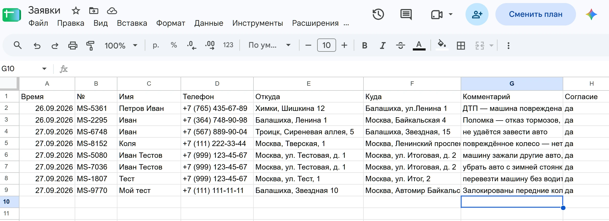

# МОСЭВАК 24 — лендинг

**🌐 Сайт: <https://bojulka2-ship-it.github.io/mosevak24/>**
Исходники: <https://github.com/bojulka2-ship-it/mosevak24>

Статический одностраничный сайт службы эвакуации с калькулятором стоимости,
формой заявки и страницей политики обработки персональных данных.

Опубликованная версия работает в **демо-режиме**: заявки не уходят в таблицу,
а сохраняются в `localStorage` браузера (см. «Подключение приёма заявок»).

Рассчитан на размещение на **GitHub Pages** — сборка не требуется: это чистые
HTML/CSS/JS без фреймворков и зависимостей.

**Лицензия:** [MIT](LICENSE) · Иконки Lucide — ISC · Шрифты — SIL OFL

---

## Возможности

| | |
|---|---|
| 🧮 | Калькулятор цены: тип авто, километраж за МКАД, доп. работы |
| 📱 | Адаптивная вёрстка, бургер-меню, мобильные CTA |
| 📮 | Форма заявки с проверкой адреса через Nominatim (OpenStreetMap) |
| 🗺️ | Интерактивная карта Яндекса с метками |
| 🔢 | Расширенный каталог ТО и ДТП (accordion, поиск, ленивая загрузка) |
| ♿ | Доступность: skip-link, `aria-label`/`aria-live`, фокус-кольца, `prefers-reduced-motion` |
| 🔍 | SEO: canonical, Open Graph, Twitter Card, `sitemap.xml`, `robots.txt`, JSON-LD |
| 🖨️ | Стили для печати и экспорта в PDF |
| 🛡️ | Строгий CSP без `unsafe-inline` и `unsafe-eval` |
| 📈 | Поддержка Яндекс.Метрики (включается одной строкой) |

---

## Быстрый старт

Сайт полностью статический — достаточно открыть `index.html` в браузере.
Для корректной проверки CSP и `fetch` к внешним сервисам нужен HTTP-сервер
(`file://` блокирует часть запросов).

```bash
# Python (если установлен)
python -m http.server 8000

# либо Node
npx --yes serve -l 8000 .
```

Откройте <http://localhost:8000/>.

---

## Публикация

Сайт опубликован: **https://bojulka2-ship-it.github.io/mosevak24/**
Исходники: <https://github.com/bojulka2-ship-it/mosevak24>

Текущая публичная версия работает в **демо-режиме** — заявки не уходят в
таблицу, а сохраняются в `localStorage` браузера. Это сделано намеренно:
публичный сайт не должен засорять рабочую таблицу заявками посетителей.
Как включить приём заявок — в разделе «Подключение приёма заявок».

Повторная публикация после изменений:

```bash
git add .
git commit -m "Правки сайта"
git push
```

Изменения на GitHub Pages применяются за 1–2 минуты.

### Как настроен домен

Адрес в `canonical`, `og:url`, `og:image`, `twitter:image`, `sitemap.xml`,
`robots.txt` и `site.webmanifest` уже проставлен в
`https://bojulka2-ship-it.github.io/mosevak24/`. При смене аккаунта или имени
репозитория замените его разом:

```bash
grep -rn 'bojulka2-ship-it\.github\.io' . --include='*.html' --include='*.xml' --include='*.txt'
```

> На GitHub Pages путь к сайту — это `/<repo>/`, поэтому в `site.webmanifest`
> стоят `start_url` и `scope` = `/mosevak24/`. Остальные ссылки относительные
> и работают из любой папки.

---

## Подключение приёма заявок

По умолчанию сайт работает в **демо-режиме**: заявка сохраняется в
`localStorage` браузера и никуда не отправляется. Пользователь видит пометку
«Демо-режим».

Чтобы отправлять заявки в Google Таблицу:

1. Создайте Google Apps Script (`doPost` → `appendRow` в таблицу).
2. Опубликуйте его: **Deploy → New deployment → Web app → Execute as: Me,
   Who has access: Anyone**.
3. Скопируйте URL вида `https://script.google.com/macros/s/AKfycb…/exec`.
4. Впишите его в `js/app.js`:

```js
const CONFIG = {
  googleScriptUrl: 'https://script.google.com/macros/s/AKfycb…/exec',
  yandexMetrikaId: '',        // например 12345678
  demoOrdersTtlDays: 1,
};
```

5. Заполните столбцы в таблице и заголовки в скрипте (ожидаются `createdAt`,
   `orderId`, `name`, `phone`, `from`, `to`, `comment`).

### Ограничения безопасности

Скрыть endpoint в статическом сайте **невозможно** — он виден в исходном коде.
Такой скрипт доступен для спама и флуда таблицы. Публикация «под ключ»
(скрытый client secret) защиты не даёт: всё, что в браузере, доступно
пользователю.

Митигация — прокси с rate-limit (Cloudflare Worker, Vercel Edge Function) или
капча reCAPTCHA в Apps Script. Подробности и полный список рисков — в
[SECURITY.md](SECURITY.md).

### Как отправляется заявка

```js
fetch(CONFIG.googleScriptUrl, {
  method: 'POST',
  mode: 'cors',                               // Apps Script шлёт Access-Control-Allow-Origin: *
  headers: {'Content-Type': 'text/plain'},    // safelisted → без preflight
  body: JSON.stringify(record),
  signal: ctrl.signal,                        // таймаут 20 с
  credentials: 'omit',
  redirect: 'follow'
});
```

Ответ читается и проверяется: показываем «Заявка отправлена» только если сервер
ответил `2xx` и `{"ok":true}`. Ошибки различаются — таймаут, HTTP-ошибка и
невозможность связаться дают разные сообщения, а детали пишутся в консоль.

> Раньше здесь стоял `mode: 'no-cors'`. Он не давал ничего: ответ приходил
> opaque (`status: 0`, тело недоступно), поэтому проверить доставку было
> нечем — код показывал успех при любом HTTP-ответе, включая 500. Плюс
> блокировка редиректа на `script.googleusercontent.com` роняла отправку целиком.

---

## Яндекс.Метрика

Впишите ID счётчика в `CONFIG.yandexMetrikaId` в `js/app.js`.
Счётчик подключается автоматически на `index.html`; в `privacy.html` —
добавьте тот же фрагмент в `js/privacy.js` вручную.

Метрика обращается к `mc.yandex.ru`, `mc.yandex.ru/metrika` и
`yastatic.net` — эти домены уже разрешены в `Content-Security-Policy`.

---

## Структура проекта

```
.
├── index.html            # Главная (калькулятор, форма, каталог, FAQ, контакты)
├── privacy.html          # Политика обработки персональных данных
├── css/
│   ├── style.css         # Стили главной
│   └── privacy.css       # Стили политики
├── js/
│   ├── app.js            # Логика главной + CONFIG
│   ├── privacy.js        # Логика политики (печать, год, иконки)
│   └── icons.js          # 27 иконок Lucide (локально, 7 КБ)
├── photos/               # Фото автопарка и ДТП (WebP + JPG-фолбэк)
├── favicon.svg
├── og-image.jpg          # 1200×630 для предпросмотра ссылок
├── site.webmanifest
├── robots.txt
├── sitemap.xml
├── .editorconfig
├── .gitignore
├── LICENSE               # MIT
├── SECURITY.md           # Политика безопасности и известные риски
└── README.md
```

---

## Технические решения

### Почему нет фреймворков и сборки

Сайт должен открываться как статические файлы и не ломаться на GitHub Pages.
Сборка добавила бы зависимости и node_modules в репозиторий без практической
пользы: объём кода небольшой, а кеширование на стороне GitHub Pages
(ETag + gzip) покрывает оптимизацию.

### Почему иконки лежат в репозитории

Оригинал грузил `lucide.min.js` (444 КБ) с `unpkg.com` с версией `@latest`.
Это плохо по трём причинам: лишний запрос к чужому домену (нужно ослаблять
`script-src`), неконтролируемые обновления и 444 КБ лишнего трафика.
Сейчас в `js/icons.js` только 27 используемых иконок — 7 КБ, без внешних
запросов, CSP остаётся строгим.

### Strict CSP

Политика задана мета-тегом в обоих HTML:

```
default-src 'self'; base-uri 'self'; object-src 'none';
frame-ancestors 'none'; form-action 'self' https://script.google.com;
img-src 'self' data: https://mc.yandex.ru;
font-src 'self' https://fonts.gstatic.com;
style-src 'self' https://fonts.googleapis.com;
script-src 'self' https://mc.yandex.ru;
connect-src 'self' https://nominatim.openstreetmap.org https://script.google.com https://script.googleusercontent.com https://mc.yandex.ru;
frame-src https://yandex.ru; manifest-src 'self'; upgrade-insecure-requests
```

Каждый внешний домен в списке соответствует реальному обращению в коде:
`nominatim.openstreetmap.org` — геокодер адреса, `script.google.com` — приём
заявок, `mc.yandex.ru` — Метрика и карта, `yandex.ru` — iframe карты.

Два неочевидных пункта:

- **`script.googleusercontent.com` в `connect-src` — обязателен.** Apps Script
  `/exec` не отвечает сразу: он отдаёт `302` на
  `https://script.googleusercontent.com/macros/echo?user_content_key=…`, и уже
  оттуда приходит результат. Если этот домен не разрешён, браузер блокирует
  редирект, `fetch` падает с `TypeError: Failed to fetch`, и пользователь видит
  «Ошибка отправки», хотя скрипт отработал. Это самая частая причина «форма не
  работает» на sites с Apps Script под строгим CSP.
- **`mc.yandex.ru` в `script-src`.** `js/app.js` подключает `metrika/tag.js`
  динамически; без этого Метрика блокировалась бы.

Ни `unsafe-inline`, ни `unsafe-eval` нет. Поэтому весь CSS и JS вынесены в
`css/` и `js/`, а локальные отступы задаются классами-утилитами
(`.mt-22`, `.calc-hint`, `.label-plain` и т.п.), а не атрибутами `style`.

> **Ограничение GitHub Pages:** HTTP-заголовки задать нельзя, поэтому CSP живёт
> в `<meta>`. Директивы `frame-ancestors`, `sandbox` и `report-uri` в мета-теге
> **игнорируются**. Защиту от кликджекинга (`frame-ancestors`) можно получить,
> только переехав за Cloudflare или другой хостинг с настройкой заголовков.

### Изображения

Каждое фото отдаётся через `<picture>`: WebP в `srcset`, JPG как фолбэк.
У всех `` заданы `width`/`height` — это предотвращает CLS при загрузке.
Главное изображение — `loading="eager"` + `fetchpriority="high"`, остальные —
`loading="lazy"`.

| Файл | WebP | JPG |
|---|---|---|
| `01-park-flatbed` | 41,8 КБ | 44,5 КБ |
| `02-park-slider` | 56,4 КБ | 68,0 КБ |
| `03-park-crane` | 20,5 КБ | 31,3 КБ |

---

## Безопасность

- Все внешние ссылки с `target="_blank"` снабжены `rel="noopener noreferrer"`.
- Пользовательский ввод выводится через `textContent` и `esc()`; в `innerHTML`
  попадают только константы.
- На всех полях формы задан `maxlength` — ограничен размер передаваемых данных.
- `maxlength` на телефоне — 25 символов, на имени — 60, на комментарии — 1000.
- Плейсхолдеры в `privacy.html` (ИНН, адрес, дата) выделены классом `.ph` —
  найдите их поиском по `class="ph"`.

Подробный разбор рисков и способ их закрыть — в [SECURITY.md](SECURITY.md).

---

## Проверка перед публикацией

```bash
# Валидация HTML
npx --yes html-validate index.html privacy.html

# Поиск inline-стилей и обработчиков (должно быть пусто)
grep -rn 'style="' index.html privacy.html
grep -rnE ' on[a-z]+="' index.html privacy.html

# Поиск незаменённых плейсхолдеров домена
grep -rn 'user\.github\.io' . --include='*.html' --include='*.xml' --include='*.txt'

# Синтаксис JS
node --check js/app.js && node --check js/privacy.js && node --check js/icons.js
```

### Чек-лист перед запуском

- [x] Заменить плейсхолдер домена на реальный
- [ ] Заполнить реквизиты оператора в `privacy.html` (ИНН, адрес, дата, email)
- [ ] Проверить телефон, e-mail, WhatsApp/Telegram в `index.html` и `js/app.js`
- [ ] Подставить `googleScriptUrl` в `CONFIG` — **сейчас демо-режим, заявки не отправляются**
- [ ] Заполнить таблицу Google Sheets и заголовки в Apps Script
- [ ] Настроить `yandexMetrikaId` (или оставить пустым)
- [ ] Обновить `<lastmod>` в `sitemap.xml`
- [ ] Проверить форму в продакшене с телефона

---

## Скриншоты

Хранятся в WebP — полностраничные снимки в PNG весили 7,4 МБ, в WebP занимают
2,3 МБ. Используются только в этом README, в вёрстке сайта не участвуют.

| Главная — десктоп | Главная — мобильный |
|---|---|
|  |  |

Структура таблицы, в которую складываются заявки:

| Таблица Google Sheets |
|---|
|  |

Переснять после изменений вёрстки и положить в репозиторий в WebP:

```bash
python -m http.server 8000

# 1. Снять в PNG (Chrome умеет писать только PNG)
chrome --headless=new --hide-scrollbars --window-size=2803,16384 \
       --screenshot=docs/screenshot-desktop.png http://localhost:8000/

# 2. Сконвертировать в WebP.
#    Предел формата WebP — 16383 px по стороне, поэтому картинки выше
#    16383 px (например полностраничные 2803x16384) нужно предварительно
#    обрезать на 1 px: -vf "crop=2803:16383:0:0". Без кропа ffmpeg ошибется.
#    -preset text подбирает параметры под текст и скриншоты.
ffmpeg -y -i docs/screenshot-desktop.png -vf "crop=2803:16383:0:0" \
       -c:v libwebp -quality 92 -compression_level 6 -preset text \
       docs/screenshot-desktop.webp

# 3. Закоммитить webp. PNG коммитить не нужно — он в .gitignore
#    (docs/*.png), лежит локально как оригинал для пересборки.
git add docs/screenshot-desktop.webp
```

---

## Плейсхолдеры, требующие замены

| Что | Где | Комментарий в коде | Статус |
|---|---|---|---|
| Домен | `index.html`, `privacy.html`, `sitemap.xml`, `robots.txt`, `site.webmanifest` | `bojulka2-ship-it.github.io` | ✅ проставлен |
| Apps Script URL | `js/app.js` | `CONFIG.googleScriptUrl` | ⏸ демо-режим, пусто |
| Телефон | `index.html`, `js/app.js` | `+7 (495) 128-24-24` | ⚠️ плейсхолдер |
| E-mail | `index.html`, `privacy.html`, `SECURITY.md` | `zakaz@mosevak24.ru` | ⚠️ плейсхолдер |
| WhatsApp / Telegram | `index.html` | ссылки вида `https://wa.me/…` | ⚠️ плейсхолдер |
| Реквизиты ООО/ИП | `privacy.html` | 15 элементов с `class="ph"` | ⚠️ плейсхолдеры |
| Координаты карты | `index.html` | атрибут `data-coords` у блока карты | ⚠️ плейсхолдер |
| ID Яндекс.Метрики | `js/app.js` | `CONFIG.yandexMetrikaId` | ⬜ не настроен |

Полный список — поиск по `class="ph"` и по строкам с плейсхолдерами.

---

## Браузеры

Требуется ES2018+ и CSS Grid/Flexbox. Проверено в Chrome, Firefox, Safari,
Edge (актуальные версии), мобильные Chrome и Safari на iOS 15+.

## Лицензия и благодарности

- **Код** — MIT, см. [LICENSE](LICENSE).
- **Иконки** — [Lucide](https://lucide.dev) (ISC). 27 иконок, зафиксированная
  версия `lucide-static@1.48.0`, изменений нет.
- **Шрифты** — Unbounded, Manrope, JetBrains Mono с Google Fonts (SIL OFL 1.1).
- **Карта** — Яндекс.Карты API.
- **Геокодер** — [Nominatim](https://nominatim.openstreetmap.org) (OpenStreetMap).
